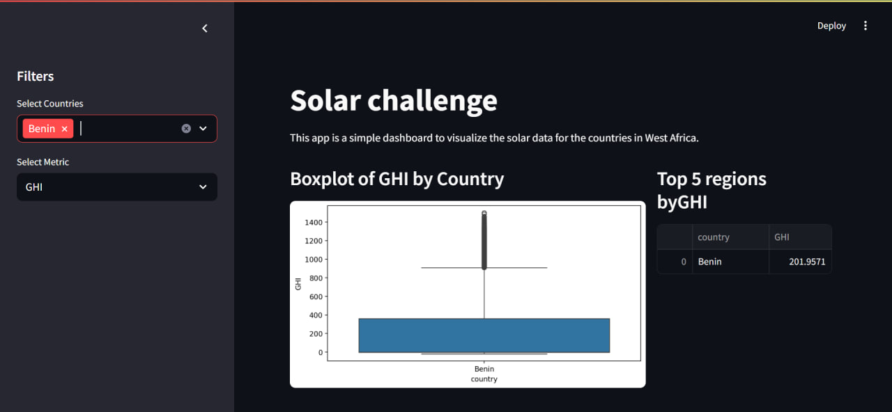
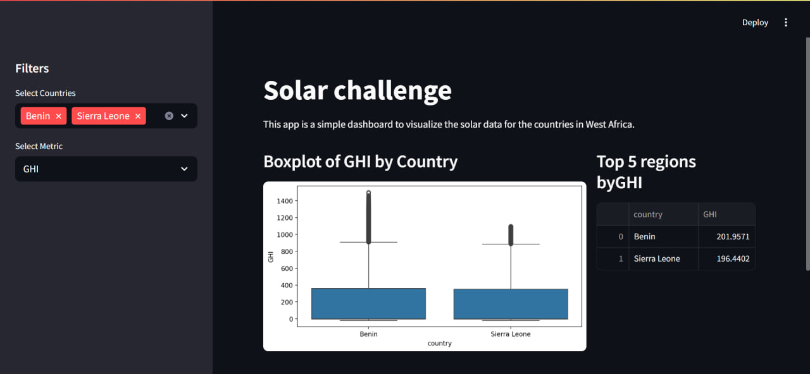
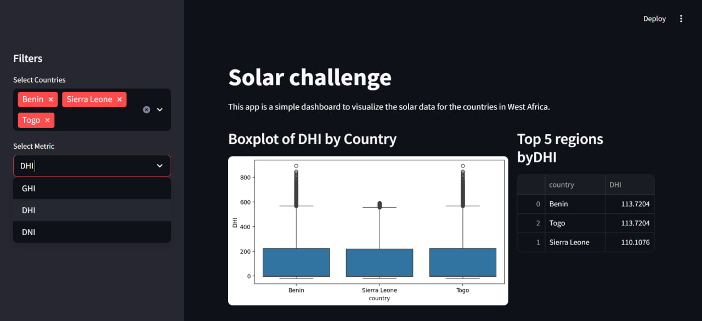

# Solar Challenge Week 1

This repository contains the code for the Solar Challenge Week 1 project, focusing on solar energy analysis in West African countries (Benin, Sierra Leone, and Togo).

## Project Overview

The project aims to analyze and visualize solar energy potential across West African countries using modern data analysis and visualization tools. The analysis is conducted through Jupyter notebooks, and results are presented through a Streamlit web application.

## Dashboard Screenshots


*Main dashboard showing solar energy potential across West African countries*


*Detailed analysis view for individual countries*


*Comparative view of solar potential across different countries*


## Project Structure

```
solar-challenge-week1/
├── app/                    # Streamlit application
│   ├── main.py            # Application entry point
│   └── utils.py           # Utility functions
├── data/                   # Data storage
├── notebooks/             # Jupyter notebooks for analysis
│   ├── Benin_eda.ipynb
│   ├── SierraLeone_eda.ipynb
│   ├── Togo_eda.ipynb
│   └── compare_countries.ipynb
├── scripts/               # Utility scripts
├── tests/                 # Test suite
└── requirements.txt       # Project dependencies
```

## Prerequisites

- Python 3.x
- pip (Python package installer)
- Git

## Setup Instructions

1. Clone the repository:
```bash
git clone https://github.com/yourusername/solar-challenge-week1.git
cd solar-challenge-week1
```

2. Create and activate a virtual environment:
```bash
# On Windows
python -m venv venv
.\venv\Scripts\activate

# On macOS/Linux
python3 -m venv venv
source venv/bin/activate
```

3. Install dependencies:
```bash
pip install -r requirements.txt
```

## Project Components

### Data Analysis
The project includes separate Jupyter notebooks for analyzing solar data from each country:
- `Benin_eda.ipynb`: Analysis of solar data from Benin
- `SierraLeone_eda.ipynb`: Analysis of solar data from Sierra Leone
- `Togo_eda.ipynb`: Analysis of solar data from Togo
- `compare_countries.ipynb`: Comparative analysis across all countries

### Web Application
The project includes a Streamlit-based web application for visualizing the analysis results:
- Located in the `app/` directory
- Main application logic in `main.py`
- Utility functions in `utils.py`

## Development

- The project uses pytest for testing
- Code style is checked using flake8
- GitHub Actions CI/CD pipeline is set up to run tests and style checks on push and pull requests

## Environment Variables

The following environment variables are used in the project:
- `.env` - Main environment file

Make sure to create these files with appropriate values for your environment.

## Contributing

1. Fork the repository
2. Create a new branch for your feature
3. Make your changes
4. Run tests and style checks
5. Submit a pull request

## Dependencies

The project uses the following main dependencies:
- pandas >= 2.0.0
- numpy >= 1.24.0
- matplotlib >= 3.7.0
- seaborn >= 0.12.0
- scipy >= 1.10.0
- jupyter >= 1.0.0
- windrose >= 1.9.2
- streamlit >= 1.23.0

For a complete list of dependencies, see `requirements.txt`.


